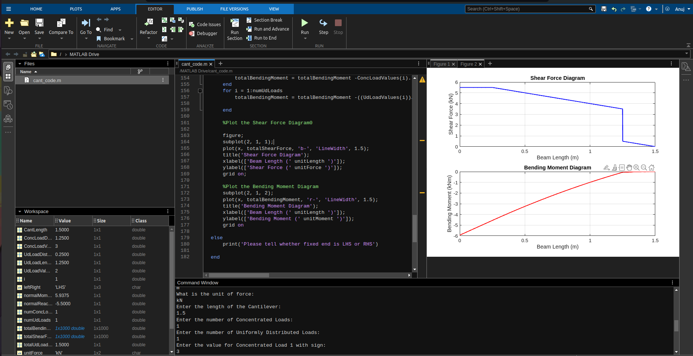

# Cantilever SFD and BMD Calculation

MATLAB code to calculate and plot Shear Force Diagram (SFD) and Bending Moment Diagram (BMD) for a cantilever beam subjected to:
- At least two concentrated loads.
- Uniformly Distributed Load (UDL) along part or the complete span of the beam.

## How to Use the Code

1. Open MATLAB and create a new script.
2. Copy the MATLAB code into the script.
3. When you run the script, it will prompt you to input the following information:

   - **Is the cantilever fixed from LHS or RHS?**  
     Specify whether the cantilever is fixed from the Left-Hand Side (LHS) or Right-Hand Side (RHS).

   - **Unit of length and force?**  
     Enter the units for length and force, e.g., meters (m) for length and Newtons (N) for force.

   - **Number of concentrated loads?**  
     Input the number of concentrated loads acting on the beam.

   - **Number of uniformly distributed loads (UDL)?**  
     Enter the number of UDLs on the beam.

   - **Value of concentrated loads with sign:**  
     For each load, provide its magnitude and direction. Take downward forces as positive (e.g., 500 N).

   - **Value of UDL with sign?**  
     Enter the magnitude of the UDL, treating downward loads as positive.

   - **Length of UDL:**  
     Specify the length over which the UDL acts.

   - **Distance of UDL from LHS:**  
     Provide the distance from the Left-Hand Side (LHS) to the start of the UDL.

   - **Distance of concentrated loads from LHS:**  
     Specify the distances from the LHS to each concentrated load.

## Features
- Automatically calculates and plots both the SFD and BMD for the given input conditions.
- Works for multiple concentrated loads and UDLs.

## Example
An example output for a cantilever beam with specific loads can be added here (e.g., screenshots or descriptions).

